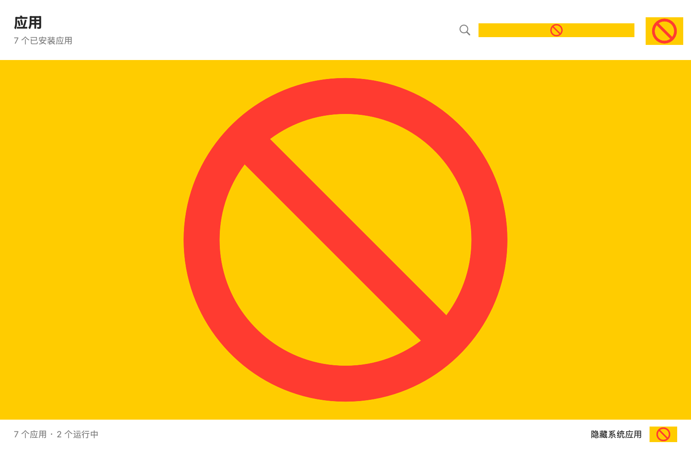
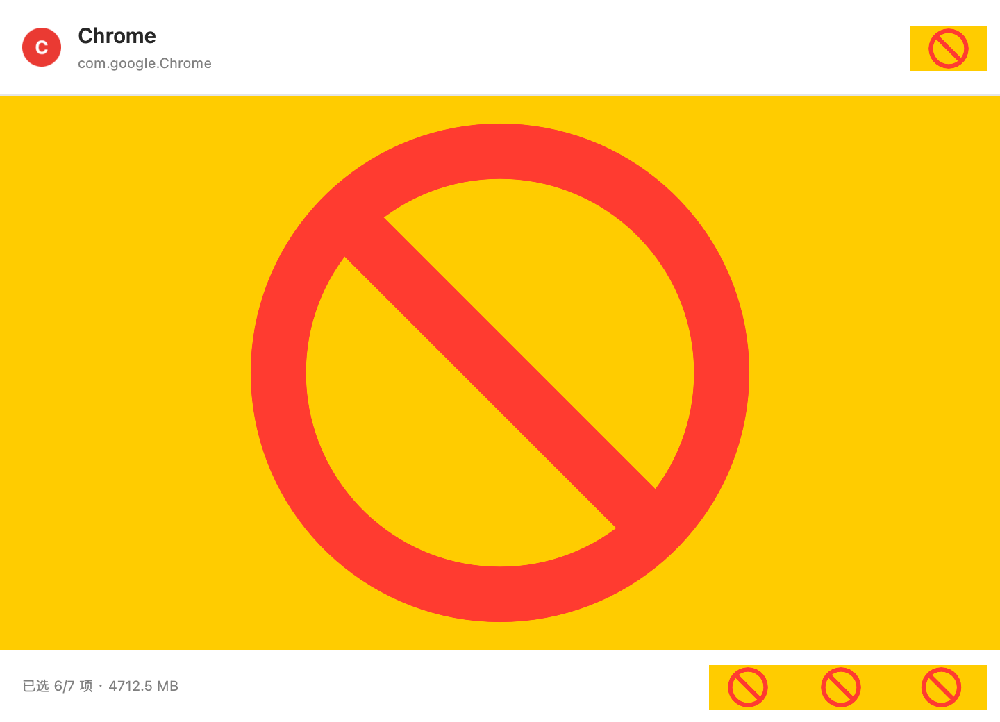

# Mug Uninstaller

 

macOS 应用卸载工具（类 Geek）：卸载应用时，找出它创建的全部文件，逐项勾选确认后一并清理，不再有残留。

## 核心特性

- **完整残留扫描**：按 bundle id / 名称 / 厂商目录覆盖 `~/Library` 与 `/Library` 全规则路径 —— 偏好设置、缓存、容器、启动项、特权助手、安装包回执等
- **置信度分级**：残留按 高 / 中 / 低 三档分组，默认勾选高与中置信项，低置信项交给你确认
- **安全卸载**：先退出进程与启动项 → 清除 pkg 回执 → 全部**移入废纸篓**（可恢复）；root 文件按单次操作弹授权；删除路径白名单守卫
- **系统应用保护**：SIP 应用标记不可卸载，默认在列表中隐藏，可一键开关
- **克制美观**：SwiftUI 原生体验、跟随系统明暗、搜索 / 状态徽标 / 运行状态一应俱全

## License

[MIT](LICENSE)

> 本工具会删除文件（默认移入废纸篓）。卸载前请确认勾选内容。
